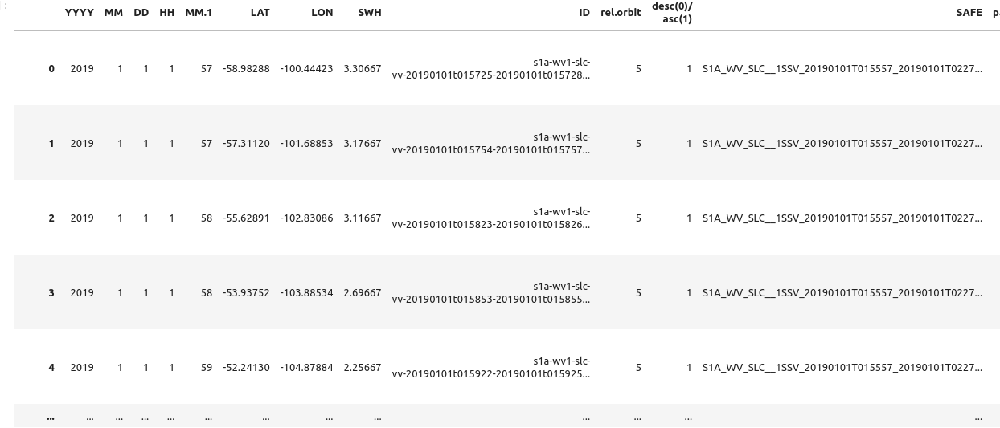

# metrics-wv-swh-bench

Several scientific teams are providing signficant wave height (Hs or SWH) predicted from SAR WV Sentinel-1 satellite mission.
In 2019 ESA project Climate Change Initiative (CCI) sea-state, developed a work-bench to give a score to the SWH predictions.
This python library aims at providing the methods to compute the score defined in the CCI sea-state document: https://climate.esa.int/media/documents/Sea_State_cci_PVASR_v1.1-signed.pdf 


## usage

```python
import mwsb
score_ndbc,score_cmems,total_score,inc_scores = mwsb.metrics.compute_metrics(df_wv_ndbc=df1,ds_wv_cmems=df2)
```

### example of input

input dataset is expected to be `pd.DataFrame` with columns: `lon`,`lat`,`swh`,`incidence-angle`.

   

### example of output

score computed look like this:

   
